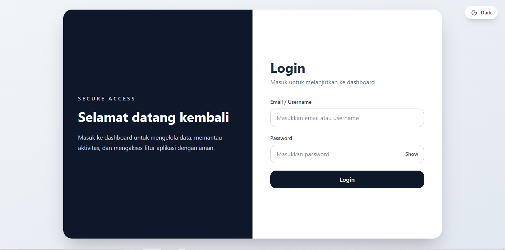
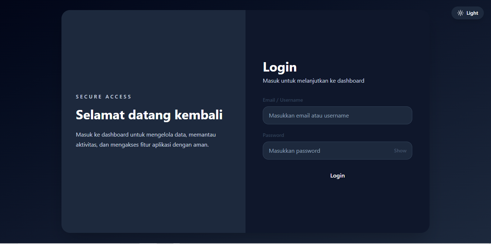
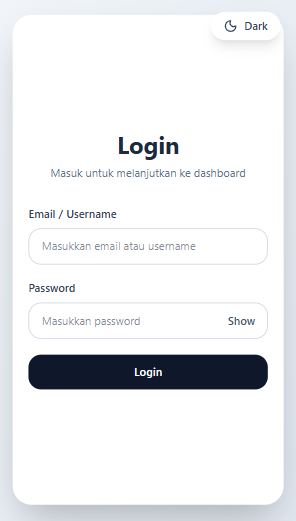
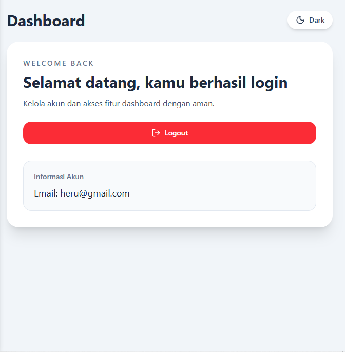

# Login Auth Sederhana
Project ini adalah aplikasi login sederhana berbasis **React** di frontend dan **Express + MySQL** di backend, menggunakan **JWT** untuk autentikasi dan **cookies** untuk sesi login.

## 💻 Tech Stack

### Frontend
- React.js (Vite)
- React Router DOM
- Tailwind CSS
- Axios

### Backend
- Node.js
- Express.js
- MySQL (mysql2)
- bcrypt (untuk hashing password)
- jsonwebtoken (JWT)
- cookie-parser
- cors

### Tools / Lainnya
- XAMPP / MySQL lokal (untuk development)
- Nodemon (hot-reload backend)

---

## Fitur
- Login / Logout dengan JWT + cookie
- Halaman Dashboard hanya bisa diakses jika login
- Validasi form login (email/username & password)
- Toggle mode Dark / Light
- Responsive UI (mobile & desktop)

## Cara Menjalankan Project

1. Clone repo
git clone
https://github.com/herugustomo/login-auth-sederhana.git
cd login-auth-sederhana

2. Install dependencies
- Frontend
npm install
- Backend
cd backend
npm install

3. Setup database MySQL
  
  Import Database (BARU)

  Project ini sudah disediakan file database agar tidak perlu membuat tabel manual.

Langkah import:
- Buka phpMyAdmin
- Buat database baru: login_sederhana
- Pilih database login_sederhana
- Klik tab Import
- Upload file berikut:
  /database/login_sederhana.sql
  Klik Go

  
Konfigurasi Backend (.env)

  Buat / edit file backend/.env:
  - PORT=5000
  - DB_HOST=localhost
  - DB_USER=root
  - DB_PASSWORD=
  - DB_NAME=login_sederhana
  - JWT_SECRET=rahasia_login_123

4. Jalankan backend
cd backend
npm run dev   # atau nodemon server.js
server akan berjalan di http://localhost:5000

5. Jalankan frontend
npm run dev
server akan berjalan di http://localhost:5173

6. Testing
- Buka http://localhost:5173/login
- Login dengan user yang ada di database
- Jika berhasil, redirect ke Dashboard
- Logout untuk menghapus sesi

### email/username & password untuk login:
- heru@gmail.com/admin
- admin1234

## Arsitektur Aplikasi
- Frontend: Menyediakan UI, mengirim request login/logout ke backend
- Backend: Memproses request, validasi password (bcrypt), generate JWT, set cookie
- JWT + Cookie: Menyimpan sesi login, digunakan untuk akses dashboard
- MySQL: Menyimpan data user
